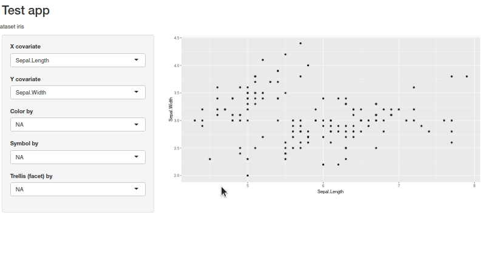

# Creating a shiny app docker image for kiosc

XXX – please replace with the links to KIOSC documentation.


## Creating a shiny app

We will create a simple shiny app which allows flexible plotting of any
dataset. We expect that the data set is a data frame with a number of
variables stored in columns. The plotting will be done using ggplot2.

How do we define which dataset to display? We will come to that shortly in
the KIOSC section below. For now, for the purposes of testing, we will
define three variables:

```
dataset <- "iris"
df <- get(dataset, "package:datasets")
title <- "Example shiny interface
```

For a shiny app, we need two objects: the user interface (UI) and the
server function. Let us create the UI first:

```
varnames <- colnames(df)

ui <- fluidPage(
 titlePanel(app_title),
 fluidRow(p(sprintf("Dataset %s", dataset)))
 sidebarLayout(
   sidebarPanel(

     selectInput("xvar",  label="X covariate", choices=varnames),
     selectInput("yvar",  label="Y covariate", choices=varnames, selected=varnames[2]),
     selectInput("color", label="Color by", choices=c("NA", varnames)),
     selectInput("symbol", label="Symbol by", choices=c("NA", varnames)),
     selectInput("trellis", label="Trellis (facet) by", choices=c("NA", varnames)),
     ),

    mainPanel(
              plotOutput("mainplot")
              )
))
```

We prepared a number of selectInput choices and, in the main panel, the
output for the plot.

The server function looks as follows:

```
server <- function(input, output) {

  output$mainplot <- renderPlot({

    g <- ggplot(df, aes_string(x=input$xvar, y=input$yvar))

    if(input$color != "NA")   { g <- g + aes_string(color=input$color) }
    if(input$symbol != "NA")  { g <- g + aes_string(shape=input$symbol) }
    if(input$trellis != "NA") { g <- g + facet_wrap(input$trellis) }
   
    g <- g + geom_point()
    print(g)
  })
}
```

Finally, the concluding statement creates the shiny app:

```
shinyApp(ui=ui, server=server)
```

We store the four statements (defining varnames, server function, the
UI and the `shinyApp` statement) in the file [app.R](build/app.R).

To test that the app is working, we can simply run it from R command line
like this:

```
library(ggplot2)
library(shiny)
app_title <- "Shiny app example"
dataset <- "iris"
df <- get(dataset, "package:datasets")
runApp("build/app.R")
```

You should be able to view the app:



## Creating the `app_run.R` script

In our docker image, we will put a small R script which prepares the
environment for the app and running the app. The reason to separate it from
`app.R` is that this script will contain KIOSC-specific statements, and
other preliminary calculations, as well as setting the port for KIOSC etc.
On the other hand, the `app.R` itself can be an independent entitity,
prepared and tested separately.

Think of it as follows: the `app.R` is the actual program, the `app_run.R`
is there to make sure all necessary data and configurations have been
loaded for the app.

The following is the contents of [app_run.R](build/app_run.R):

```
library(shiny)
library(ggplot2)

## get the variables defined in KIOSC
app_title <- Sys.getenv("TITLE")
if(app_title == "") { app_title == "Test app" }

dataset   <- Sys.getenv("DATASET")
if(dataset == "") { dataset <- "iris" } 

## TODO: check that this works
df <- get(dataset, "package:datasets")

runApp("app.R", launch.browser = FALSE, port = 8080, host = "0.0.0.0")
```

In the above, we use `Sys.getenv` to get the environmental variables set by
KIOSC. These are in turn defined in the KIOSC interface when specifying a
container, using a JSON notation.

While a simple file like the one above suffices for an example, it should
take care of ensuring that the environmental variables are correctly
defined and that the necessary data sets for the app are in place.

## Dockerfile

One last piece missing is the Dockerfile which instructs docker how to
build an image. We will use the image `rocker/shiny` as the base for our
docker image. The `rocker/shiny` docker image contains already R and shiny,
the only thing that is left is to install `ggplot2`, specify the port on
which our app will be listening and the command to run:

```
## Start with the shiny docker image from the rocker project
## https://www.rocker-project.org/
FROM rocker/shiny:latest

## install necessary R libraries
RUN R -e "install.packages(c('ggplot2'))"

## expose the port on which shiny runs
EXPOSE 8080

#copy the current folder into the path of the app
COPY . /usr/local/src/app

#set working directory to the app
WORKDIR /usr/local/src/app

## the app_run.R wrapper contains the R command to run the app
## The actual app is defined in app.R
CMD ["/usr/local/bin/Rscript", "app_run.R" ]
```

Above: the contents of [Dockerfile](build/Dockerfile)

## Building the image

For this step, we need to have [docker installed](https://docs.docker.com/get-docker/). 
From command line, we can now call docker to build the image:

```
docker build -t ghcr.io/bihealth/kioscshinytest:latest build
```

This will download the `rocker/shiny` image (if necessary), install
ggplot2, copy the contents of the build directory to `/usr/local/src/app`
and build the image. 

Note that the tag (`ghcr.io/bihealth/kioscshinytest`) should be replaced by the
respective repository to which you can upload the data. 
In the above, I have tagged the image using the
Container Registry from github (ghcr.io) and our BIH repository.
Refer to the
[docker documentation on registry](https://docs.docker.com/registry/) and,
for example, the documentation on the github Container Registry
[ghcr.io](https://docs.github.com/en/packages/working-with-a-github-packages-registry/working-with-the-container-registry).

One important thing to keep in mind is that presently, the images for KIOSC
should be publicly accessible – KIOSC does not have permissions to access
private images in a registry.

## Testing the image

The simplest test is to run the image:

```
docker run bihealth/kioscshinytest:latest
```

This, however, is not very convenient – docker chooses a random port on our
machine to map the 8080 port from the image. We can tell it that we want to
use 8080 on our machine as well:

```
docker run -p 8080:8080 ghcr.io/bihealth/kioscshinytest:latest
```

If you now open the URL [http://localhost:8080](http://localhost:8080), you
should see our simple App up and running. Congratulations, the hardest part
is now done.

We can also test whether the environmental variables are correctly passed
on to the app:

```
docker run -e TITLE="The mtcars dataset" -e DATASET="mtcars" -p 8080:8080 ghcr.io/bihealth/kioscshinytest:latest
```

One thing that remains is to push the image to the Registry:

```
docker push ghcr.io/bihealth/kioscshinytest:latest
```

At this stage, if this is the first time you are pushing this image, you
need to make sure that the repository (here: kioscshinytest) is made
public. Refer to the instructions of your Container Registry of choice how
to ensure this.

## Configuring KIOSC

Once the image has been uploaded, the only thing that remains is to
configure KIOSC. For this, create a project in KIOSC [XXX] and create a new
container [XXX]. We need to enter the following in the respective fields:

|  Entry field        | Value                                           |
| ------------------- | ----------------------------------------------- |
| Repository          |ghcr.io/bihealth/kioscshinytest                  |
| Tag                 |latest                                           |
| Container port      |8080                                             |
| Environment         |`{"DATASET":"iris", "TITLE":"Kiosc shiny test"}` |

Start the container and you should be able to view the app from KIOSC.
That's it!
